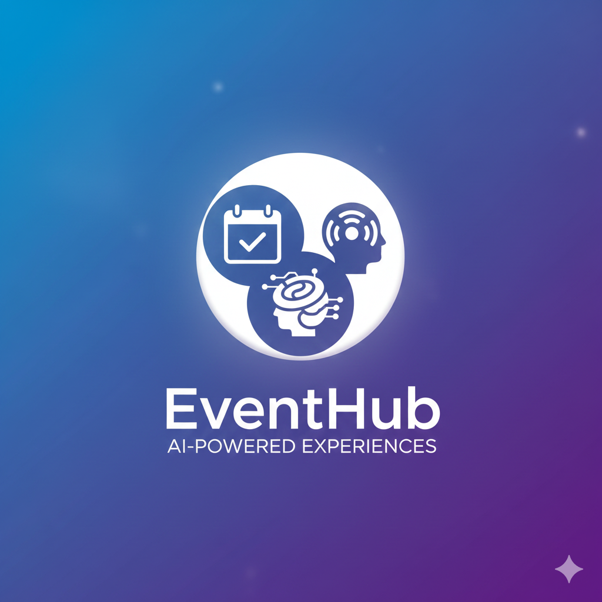

  

<h1> 📅 EventHub – AI-Powered Event Management System </h1>
<h3 align="center">
  Modernizing event discovery and registration through the power of Gemini 3 Pro.
</h3>

A comprehensive, full-stack application designed to modernize the organization and booking of events. This project leverages **Generative AI** to provide a frictionless experience for attendees and a robust management suite for administrators.
 

 

  
  
  
  
  

## **🔗 Deployment Links**

| Layer | URL |
| :--- | :--- |
| **Frontend (Live)** | [https://eventhub-satyam.netlify.app/](https://eventhub-satyam.netlify.app/) |
| **Backend (API)** | [https://event-hub-backend-y0y7.onrender.com/](https://event-hub-backend-y0y7.onrender.com/) |

---

## **📖 Project Overview**

The core objective of EventHub is to replace legacy event tracking with an intelligent, automated solution. By integrating **Google Gemini 3 Pro**, the platform removes manual data entry barriers and uses reasoning-based logic to connect users with the right events.

### **User Roles**
1.  **General Users:** Browse personalized event feeds, use AI-powered "Scan & Go" registration, and manage bookings.
2.  **Moderators:** Elevated users who can manage event listings and monitor attendee lists.
3.  **Administrators (Super Admin):** Full system oversight, including staff management (promoting/demoting users) and security audit logs.

---

## **🏗 Technical Architecture**

The project follows a modern **Decoupled Architecture** ensuring high scalability and performance:

* **Frontend (Presentation):** A responsive, high-performance SPA (Single Page Application) built with **React.js**.
* **Backend (Business Logic):** A RESTful API built with **Node.js** and **Express.js** managing authentication and AI integrations.
* **AI Engine (Intelligence):** Powered by **Google Gemini 3 Pro Preview** for multimodal data extraction and recommendation logic.
* **Database (Storage):** **MongoDB** (via Mongoose) for flexible, document-based data handling.

---

## **🛠 Tech Stack**

| Component | Technology Used |
| :--- | :--- |
| **Frontend** | React.js, Tailwind CSS (Glassmorphism UI), Framer Motion |
| **Backend** | Node.js, Express.js |
| **AI Model** | Gemini 3 Pro Preview (Multimodal & Reasoning) |
| **Database** | MongoDB (NoSQL) |
| **Auth & Security** | Supabase (OTP), JWT, Role-Based Access Control (RBAC) |
| **Communication** | Nodemailer (Staff Invitations & Passwords) |

---

## **✨ Key Features**

### **🤖 AI-Driven Intelligence**
* **Smart Registration:** Users upload an ID card image; Gemini extracts the Name, Email, and Age to auto-fill forms instantly.
* **Intelligent Recommendations:** Gemini analyzes user profiles to suggest events with human-like reasoning (e.g., matching a CS student with a Hackathon).

### **👤 User Experience**
* **Secure Authentication:** Multi-factor protection using Supabase OTP and hashed credentials.
* **Event Discovery:** High-fidelity dashboard displaying venue, price, date, and AI-generated "Top Picks."
* **Notification System:** Real-time in-app alerts for team invitations and role updates.

### **🛡 Administration & Staffing**
* **Staff Management:** Secure invitation system where potential Moderators must accept an invite to reveal their access credentials.
* **CRUD Operations:** Full control over event lifecycles (Create, Read, Update, Delete).
* **Security Audit:** Detailed system logs tracking administrative actions and role changes.

---

## **📸 Application Screenshots**

To maintain a consistent look, all screenshots are scaled to a standard width.

### **1. Welcome & Discovery**

### **2. AI Auto Recommendation**

### **3. AI Smart Fill**

### **4. AI Smart Registration**

### **5. Admin Management Dashboard**

### **6. User Profile & Bookings**

---

## **👨‍💻 Authors**

**| Satyam Mondal | Aritra Giri |**
* *Project Type:* Full-Stack AI Integration
* *Focus:* MERN Stack, Generative AI Implementation, & Secure System Architecture

